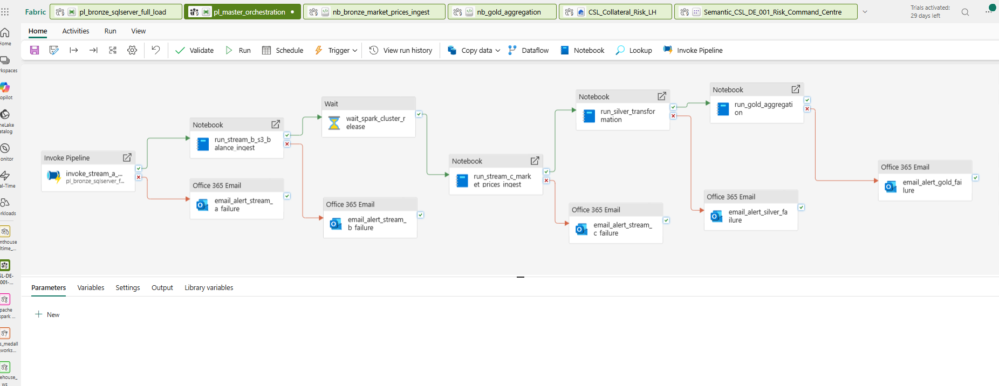
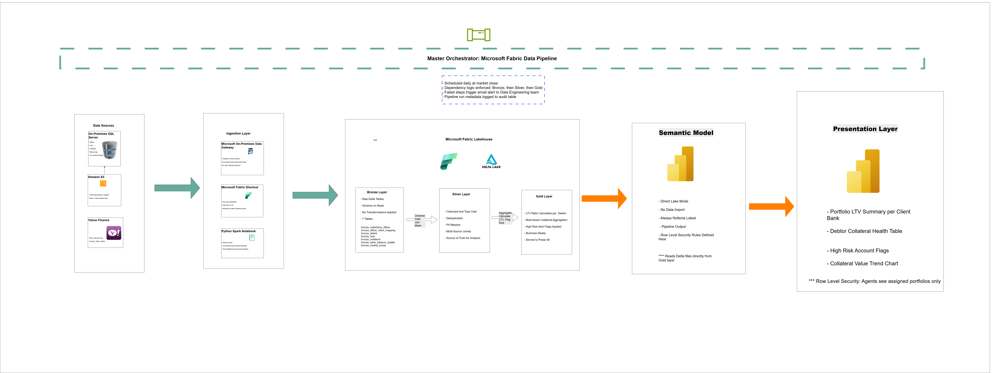
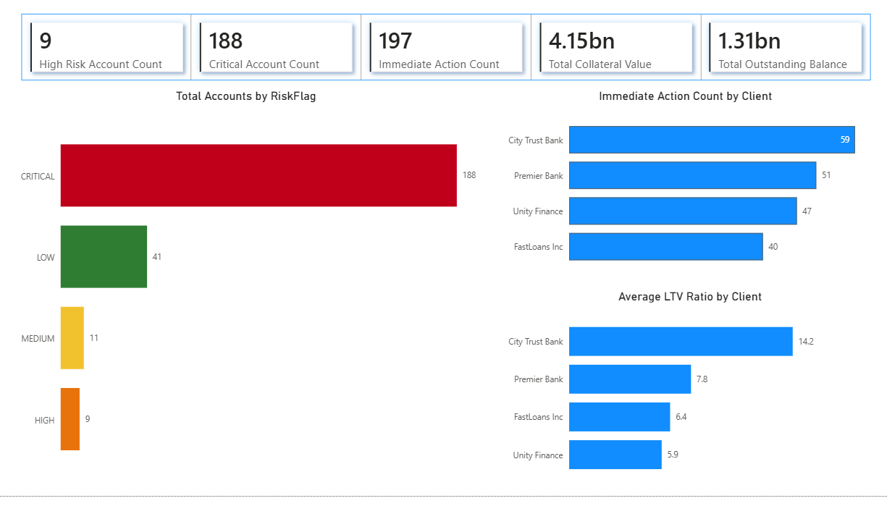

# CSL-DE-001: Collateral Risk Monitoring & Margin Call Automation System

**Collection Solutions Limited | Data Engineering Division | Microsoft Fabric**

End-to-end data engineering pipeline on Microsoft Fabric monitoring debtor 
collateral risk and automating margin call alerts via a daily LTV Risk Command Centre.




## Table of Contents
- [Overview](#Overview)
- [Business Problem](#business-problem)
- [Architecture](#architecture)
- [Power BI Risk Command Centre](#power-bi-risk-command-centre)
- [Pipeline Results](#pipeline-results)
- [Technical Stack](#technical-stack)
- [Key Engineering Features](#key-engineering-features)
- [LTV Calculation Logic](#ltv-calculation-logic)
- [Pipeline Orchestration](#pipeline-orchestration)
- [Data Governance & Security](#data-governance--security)
- [Architecture Decision Notes](#architecture-decision-notes)
- [Setup & Exploration](#setup--exploration)
- [Repository Structure](#repository-structure)
- [Known Limitations and Technical Debt](#known-limitations-and-technical-debt)
- [Documentation](#documentation)
- [Project Context](#project-context)


## Overview

Collection Solutions Limited (CSL) is a Nigerian debt recovery and financial assurance agency managing delinquent receivables on behalf of multiple client banks. This project implements an automated, end-to-end data engineering pipeline that monitors the market value of debtor pledged collateral against outstanding loan balances daily, triggering margin call alerts before collateral value falls below the debt threshold. The pipeline transforms CSL from a reactive collections agency into a proactive, data-driven risk management operation.

## Business Problem

Debtors who pledge volatile assets such as stocks and cryptocurrency as loan collateral present a significant recovery risk when market values decline. Without automated monitoring, collection actions are triggered reactively after collateral value has already eroded below the outstanding debt threshold, reducing the likelihood of full recovery.

This pipeline solves that problem by computing Loan-to-Value ratios per debtor daily, flagging high-risk accounts automatically, and surfacing actionable insights through a Power BI Risk Command Centre dashboard.


##Architecture



The pipeline follows a Medallion Lakehouse architecture on Microsoft Fabric, ingesting data from three sources into Bronze, transforming and joining in Silver, computing business logic in Gold, and serving a Direct Lake Power BI dashboard.

| Layer | Responsibility |
| :--- | :--- |
| **Bronze** | Raw Delta tables. Schema on read. No transformations. |
| **Silver** | Cleansed, typed, deduplicated, joined, PII masked. |
| **Gold** | LTV calculations, risk flags, business ready output. |


## Pipeline Results

These metrics are from live automated pipeline runs on the synthetic CSL portfolio.

| Metric | Value |
|---|---|
| Total debtor accounts monitored | 249 per daily snapshot |
| Accounts flagged ImmediateActionRequired | 225 out of 249 (90%) |
| CRITICAL risk accounts (LTV >= 1.00) | 221 |
| HIGH risk accounts (0.80 <= LTV < 1.00) | 4 |
| Daily pipeline snapshots accumulated | 3 and growing |
| Referential integrity validation | 0 orphaned records across 6 foreign key checks |
| Records quarantined due to data quality | 0 fact table quarantines on all runs |
| Stale price records handled gracefully | 232 records resolved via 5-day lookback |
| Missing price records flagged and excluded | 17 BTC-USD weekend gap records |
| Balance authority rule applied | 236 records resolved to S3 source, 13 to on-premises fallback |
| Total Bronze tables | 8 |
| Total Silver tables | 5 |
| Total Gold tables | 9 |
| Data quality issues handled at Silver | 21 HIGH severity findings across 8 Bronze tables |

> 90% ImmediateActionRequired rate is consistent with a debt recovery portfolio 
> where CSL manages defaulted and delinquent accounts rather than performing loans.


## Power BI Risk Command Centre

The dashboard connects to the Gold layer star schema via Direct Lake mode. 
No data import. Always reflects the latest pipeline output.

**View 1: Portfolio LTV Summary**


Three RLS roles implemented: CollectionsOfficer, RiskAnalyst, Admin. 
Officers see only debtors assigned to their portfolios via 
USERPRINCIPALNAME() filtering on dim_collections_officer.


## Data Sources

| Data Source | Technology | Description |
| :--- | :--- | :--- |
| **On-Prem SQL Server** | MS Data Gateway | CSL internal debtor, loan, collateral, and officer records. |
| **Amazon S3** | Fabric Shortcut | Daily Parquet balance update files (4 client banks). |
| **Yahoo Finance** | Python (yfinance) | Daily closing prices for AAPL, TSLA, GOOGL, MSFT, AMZN, NVDA, BTC-USD. |


## Technical Stack

| Category | Technology |
| :--- | :--- |
| **Platform** | Microsoft Fabric (Lakehouse, Spark, Data Pipeline, Power BI) |
| **Storage** | Delta Parquet, OneLake |
| **Ingestion** | Fabric Data Pipeline, On-Prem Gateway, Fabric Shortcut, PySpark |
| **Transformation** | PySpark Notebooks, Medallion Architecture |
| **Orchestration** | Fabric Data Pipeline (w/ dependency logic & failure alerts) |
| **Presentation** | Power BI Direct Lake mode (w/ Row Level Security) |
| **Version Control** | Git, GitHub (branch-based environment promotion) |
| **Cloud/Local** | AWS S3 (Landing Zone), On-Prem SQL Server |


## Key Engineering Features

* <u>**Hybrid Cloud Connectivity**</u>: <br>
  Secure extraction from an on-premises SQL Server via Microsoft On-Premises Data Gateway without exposing the database to the open internet. Standard enterprise pattern for hybrid architectures.
  
* <u>**Zero-Copy S3 Integration**</u>: <br>
  Client bank balance files in S3 are mounted as native Lakehouse paths via Fabric Shortcuts, eliminating redundant data movement and storage costs.
  
* <u>**Incremental Loading**</u>: <br>
  Watermark-based incremental logic on the SQL Server and API sources ensures only new or changed records are processed on each run, reducing compute cost and pipeline runtime significantly.
  
* <u>**Multi-Asset LTV Aggregation**</u>: <br>
  LTV ratio is computed by aggregating the current market value across all collateral positions per debtor before dividing by outstanding balance. A debtor holding multiple tickers across multiple loans is handled correctly.
  
* <u>**Data Quality Framework**</u>: <br>
  Dirty records are never silently dropped. Every data quality issue is flagged with a specific flag column and an is_eligible_for_ltv boolean controls which records participate in LTV calculation. Bad records are quarantined and visible for investigation - ensuring auditability.
  
* <u>**PII Protection**</u>: <br>
NationalID (BVN) is SHA-256 hashed at the Silver layer. This field has no operational purpose in the dashboard and is permanently anonymised. Contact fields including PhoneNumber, EmailAddress, and ResidentialAddress pass through to the Gold layer in readable form and are protected via Row Level Security and Object Level Security at the Power BI semantic model layer. Collections officers require contact details to reach debtors. Irreversible hashing of these fields would destroy operational utility.
  
* <u>**Row-Level Security (RLS)**</u>: <br>
  Power BI RLS rules map each collection officer to their assigned client portfolios and regions via the officer_client_mapping table. Officers see only the   <br> accounts they are authorised to action.
  
* <u>**Audit Trail**</u>: <br>
  Every pipeline run logs start time, end time, row counts, and source system to a metadata table, providing a full forensic audit trail of data movement.


## Data Governance & Security

| Requirement | Implementation | Status |
|---|---|---|
| PII Protection | SHA-256 hashing of NationalID at Silver layer | Complete |
| Row Level Security | Power BI semantic model RLS via USERPRINCIPALNAME() filtering on dim_collections_officer | Complete |
| Object Level Security | Designed for PII columns in dim_debtor via XMLA endpoint and Tabular Editor | Deferred - see note below |
| OneLake Storage Security | Designed for storage level column restriction across all Fabric engines via OneLake data access roles | Deferred - see note below |
| Access Control | Microsoft Fabric workspace roles | Complete |
| Audit Trail | gold_audit_log table capturing every pipeline step per run | Complete |

## Security Implementation Note

Two security features were designed but not implemented fully due to Fabric free trial environment constraints:

**Object Level Security (OLS):** Implementation requires XMLA endpoint access via Tabular Editor. XMLA endpoint is not available on Fabric free trial accounts. In a production environment OLS would be configured on PhoneNumber, EmailAddress, and ResidentialAddress columns in dim_debtor, restricting visibility to CollectionsOfficer and Admin roles only.

**OneLake Data Access Roles:** Implementation requires Microsoft Entra ID organisational credentials. Personal Microsoft accounts on Fabric free trial do not support this feature. In a production environment OneLake data access roles would enforce column level restrictions at the storage layer, applying across all Fabric engines including Spark, the SQL Analytics Endpoint, and Power BI. This provides a stronger security posture than semantic model level OLS alone because it cannot be bypassed by querying through an alternative engine.

The security architecture is fully designed and documented. RLS is implemented and tested. Both deferred features would be prioritised in a production deployment.


## Pipeline Orchestration

The master Fabric Data Pipeline executes all steps in dependency order daily at market close:

| Order | Action |
| :--- | :--- |
| 1 | Extract from on-premises SQL Server via Gateway to Bronze |
| 2 | Validate S3 Shortcut and register new client bank files to Bronze |
| 3 | Run yfinance Spark Notebook to fetch latest market prices to Bronze |
| 4 | Run Silver transformation notebook |
| 5 | Run Gold aggregation notebook |
| 6 | Trigger Power BI semantic model refresh |

Failed steps trigger an email alert to the Data Engineering team. Each step logs to a pipeline metadata table.


## LTV Calculation Logic
```
Total Collateral Value  = SUM(QuantityHeld x CurrentMarketPrice) across all eligible collateral positions per debtor
Total Outstanding Balance = SUM(CurrentOutstandingBalance) across all active and defaulted loans per debtor
LTV Ratio               = Total Outstanding Balance / Total Collateral Value
LTV Percentage          = LTV Ratio x 100
```

Risk flag thresholds: CRITICAL where LTV >= 1.00, HIGH where 0.80 <= LTV < 1.00, 
MEDIUM where 0.60 <= LTV < 0.80, LOW where LTV < 0.60.

Edge case handling: where no price exists for a ticker on the current date, the most recent available price within the last 5 business days is used. 
Records with no price within 5 days are flagged as MISSING and excluded from LTV calculation.

## Architecture Decision Notes

**Lakehouse over Fabric Data Warehouse**: <br>
A Lakehouse was chosen over a Fabric Data Warehouse because the pipeline is notebook-driven with PySpark, data arrives raw and unstructured at Bronze requiring schema flexibility, and Power BI Direct Lake mode requires Delta tables in a Lakehouse. A Warehouse would be appropriate for a high concurrency SQL analyst workload, which is not the use case here.

**Spark Notebook over Eventstream for API Ingestion**: <br>
Eventstream is designed for continuous unbounded event streams. Daily end-of-day API calls are a scheduled batch operation. A Spark Notebook provides full control over rate limiting, JSON flattening, incremental watermark logic, and error handling. The tool fits the workload.

**NYSE Tickers over NGX Tickers**: <br>
NGX-listed securities on Yahoo Finance have inconsistent data coverage and frequent gaps. NYSE and NASDAQ tickers provide reliable, consistent daily price data. In a production environment, NGX securities would be handled via a licensed market data feed.


## Setup & Exploration

This project runs on Microsoft Fabric and cannot be executed locally 
end-to-end. The following components are required to replicate the environment:

**Prerequisites:**
- Microsoft Fabric workspace with Lakehouse provisioned
- Microsoft On-Premises Data Gateway installed on a local machine with SQL Server
- AWS S3 bucket with the folder structure defined in `scripts/s3-simulation/`
- Python environment with dependencies: pyodbc, pandas, pyarrow, boto3, yfinance

**To generate synthetic source data:**
```bash
# Navigate to data-generation folder
# Run the Jupyter notebook to populate SQL Server tables
# See data-generation/ folder for the full generation notebook
```

**To simulate S3 client bank drops:**
```bash
# Navigate to scripts/s3-simulation/
# Run generate_bank_drops.py to generate Parquet files and upload to S3
python scripts/s3-simulation/generate_bank_drops.py
```

**To run the full pipeline:**
Trigger `pl_master_orchestration` in the Microsoft Fabric workspace. 
The pipeline executes all steps in dependency order: Bronze ingestion, 
Silver transformation, Gold aggregation, Power BI refresh.

**To explore the Gold layer:**
Query Gold tables directly via the Lakehouse SQL Analytics Endpoint 
or connect Power BI via Direct Lake mode using the semantic model 
`Semantic_CSL_DE_001_Risk_Command_Centre`.


## Repository Structure

> Note: Microsoft Fabric's Git integration commits Fabric items such as: (notebooks, pipelines, environments) directly to the repository root with their item type appended.
> This is Fabric's native behaviour and reflects a workspace-level Git sync rather than a file-level commit.
```
csl-de-001-collateral-risk-pipeline/
├── nb_bronze_market_prices_ingest.Notebook    # Stream C: yfinance API ingestion
├── nb_bronze_s3_bank_balance_ingest.Notebook  # Stream B: S3 Parquet ingestion  
├── nb_setup_pipeline_metadata.Notebook        # Watermark seed notebook
├── nb_silver_transformation.Notebook          # Silver cleaning and transformation
├── nb_gold_aggregation.Notebook               # Gold star schema aggregation
├── pl_bronze_sqlserver_full_load.DataPipeline # Stream A: SQL Server ingestion
├── pl_master_orchestration.DataPipeline       # Master orchestration pipeline
├── env_csl_de_001_bronze.Environment          # Managed environment with yfinance
├── CSL_Collateral_Risk_LH.Lakehouse           # Lakehouse definition
├── data-generation/                           # Synthetic data generation notebook
├── scripts/
│   └── s3-simulation/                         # S3 Parquet file generation scripts
├── docs/
│   ├── architecture/                          # Draw.io and SVG architecture diagrams
│   ├── business-rules/                        # Business Rules Document v1.0
│   ├── data-dictionary/                       # Gold layer Data Dictionary v1.0
│   └── gold/                                  # Gold Layer Summary v1.0
├── config/                                    # Configuration templates
├── .gitignore
└── README.md
```


## Known Limitations and Technical Debt

The following items were designed and documented but not fully implemented due to Fabric free trial environment constraints or scope decisions. 
Each has a defined remediation path for a production deployment.

| Item | Severity | Reason | Remediation |
|---|---|---|---|
| Stream A watermark implementation | MEDIUM | Deferred due to Fabric trial time constraints. SQL Server ingestion currently uses full load pattern. | Implement Max date watermark logic on Stream A to reduce pipeline runtime and compute cost in production |
| View 4 Collateral Value Trend | LOW | Requires minimum 5 daily LTV snapshots to render a meaningful trend line. Deferred pending data accumulation. | Build once sufficient daily snapshots are available. Pipeline is running daily and accumulating data automatically |
| BTC-USD weekend price gaps | MEDIUM | yfinance returns NULL ClosePrice for BTC-USD on weekend dates. 17 records flagged as MISSING and excluded from LTV. | Source weekend crypto prices from Coinbase or Binance API in production |
| Public holidays not modelled in dim_date | LOW | Licensed holiday calendar required for accurate IsMarketDay classification. | Integrate a licensed public holiday calendar in production |

## Documentation
| Document | Description |
|---|---|
| [Business Rules Document](docs/business-rules/CSL_DE_001_Business_Rules_v1.0.md) | Defines LTV formula, risk thresholds, balance authority rule, stale price logic, and all business rules implemented in the Gold layer |
| [Gold Layer Summary](docs/gold/CSL_DE_001_Gold_Layer_Summary_v1.0.md) | Complete summary of the Gold layer build including business logic implemented, dimensional modelling decisions, idempotency mechanisms, and pipeline run results |
| [Data Dictionary - Gold Layer](docs/data-dictionary/CSL_DE_001_Data_Dictionary_Gold_v1.0.md) | Column level definitions for all 9 Gold layer tables including data types, nullability, descriptions, and example values |
| [Architecture Diagram - High Level](docs/architecture/CSL_DE_001_Architecture_HighLevel_v1.0.svg) | End-to-end architecture showing all five zones from data sources to presentation layer |
| [Architecture Diagram - Ingestion Detail](docs/architecture/CSL_DE_001_Architecture_Ingestion_Detail_v1.0.svg) | Detailed ingestion diagram showing each source connection, tool, and Bronze landing pattern |


## Project Context

This pipeline was designed and built based on operational challenges observed in the debt recovery and financial assurance industry. All data used in this project is fully synthetic, generated specifically to simulate realistic data quality issues and relational complexity. No real debtor, client, or financial data was used at any stage. The business rules, risk thresholds, and data flow design reflect realistic operational patterns in the Nigerian financial services debt recovery context.

***(CSL-DE-001 | Data Engineering Division | March 2026)***
